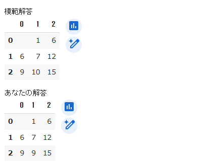

# Prog2kakushin
## work1
### どういうプログラム
百ます計算のマスの数と加算乗除を選択し、計算結果を入力して正誤判定を行う

### どんな状況で使えるか
ゲーム感覚で計算の基礎を使える

### 入力と出力
正方形の一片の数字の数 n と計算の方法（加減乗除）を入力する。1~9の値をランダムに作成し、横軸縦軸ともにn個ずつ格納していき、計算用紙を表示する。それぞれの計算をひとつづつ入力していき、それぞれの計算箇所に入力された値を挿入していき、解答との正誤判定を行う。正答数を出力し、コンピュータが作成した解答とユーザーの解答を表示する。

## work2
### どういうプログラム
入力された数値から散布図、近似直線、その直線の傾きと切片を計算する

### どんな状況で使えるか
散布図を使ってデータ分析を行うために、散布図の作成や近似直線を作成、分析する際に使えると考える

### 入力と出力
要素の数を入力し、その数だけそれぞれの値をひとつづつ入力する。横軸と縦軸のラベルを入力すると、各要素を点で表した散布図とその近似直線がプロットされたグラフ、近似直線の傾きとその切片が出力される

## work3
### どういうプログラム
画像ファイルjpgをアップロードし、読み込んだ画像の指定の箇所の色のBGR値とその色が一面に塗られた画像を出力する

### どんな状況で使えるか
色の抽出を行う際に使えると考える

### 入力と出力
画像データを.jpgの形でアップロードし、ファイルの名前を入力する。読み込んだファイルが指定したサイズより大きい場合は左右の比率を変えないようしながら調節する。基画像に指定された値ずつ等間隔に線を格子状に加え、その画像を表示する。色の判定を行う箇所の座標を入力すると、判定個所を丸く囲んだ画像と抽出された色が一面に塗られた画像、その色のBGR値が出力される。

